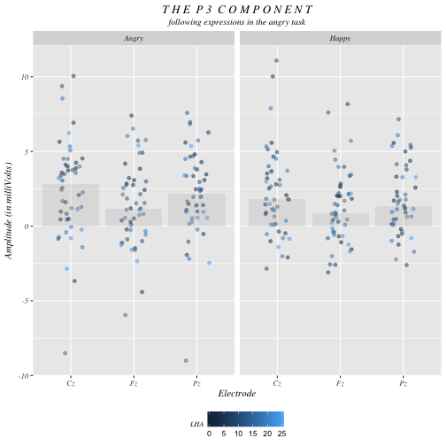
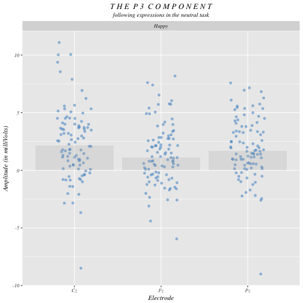
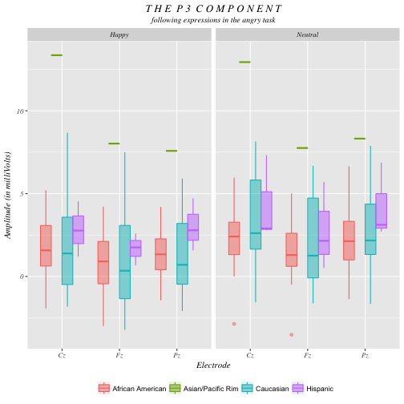
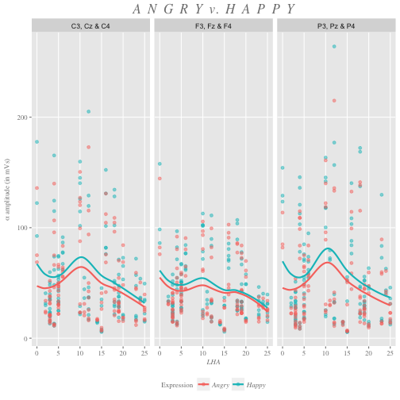
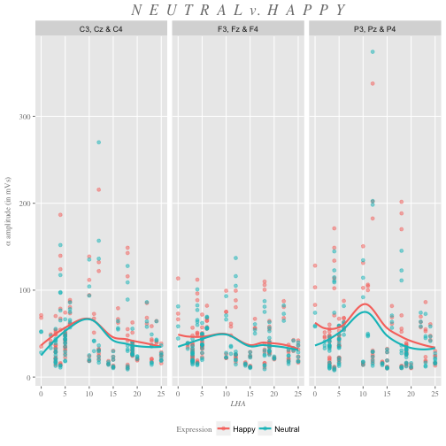
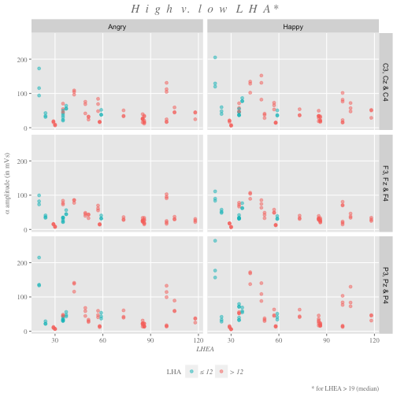
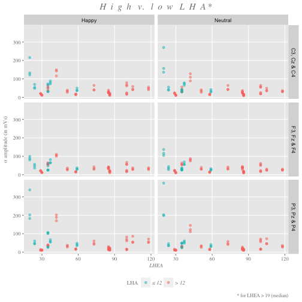

Neurophysiological responses to threatening and/or unexpected stimuli
========================================================
author: Don Lyons and Nicole Sullivan
autosize: true


Applied Question
========================================================

Why are some individuals resilient in the face of experienced aggression, while others develop high aggression?

Research Question
========================================================

How do those who have high lifetime committed aggression differ neurophysiologically from those who have low committed aggression?  How does lifetime experienced aggression impact this relationship?

Background, Methods & Techniques
========================================================

Lower alpha-amplitude, recently, has been correlated with high aggression.  This lower alpha-amplitude, generally, is correlated with recruitment of lesser cognitive resources in response to a stimulus.  In athletes, this "alpha burst" has been found to be helpful in reducing cognitive activity and increasing motor activity just prior to execution of a well-rehearsed movement, with optimal performance occurring following lowest alpha amplitude.  This study sought, first, to replicate findings that aggressive individuals exhibit lower alpha in response to angry stimuli, and second, sought explore differences between individuals who had low committed aggression, but high experienced aggression, and individuals who had both high committed and experienced aggression.

```
{r setup, include=FALSE}
knitr::opts_chunk$set(echo = FALSE, warning = FALSE, message = FALSE)
```

```{r}
library(tidyverse)
erp_erd <- read_csv("ERP_ERD.csv")
```

Stripchart of Expressions in the Angry Task
========================================================



```{r}
Cz_Fz_Pz <- erp_erd %>%
  filter(Electrode == "Cz" | Electrode == "Pz" | Electrode == "Fz")

Cz_Fz_Pz %>%
  filter(Task == "A") %>%
  mutate(Expression = ifelse(Expression == "A", "Angry", "Happy")) %>%
ggplot(aes(Electrode, Mean_Amplitude, color = LHA)) +
  geom_jitter(position=position_jitter(0.2), alpha = 0.5) +
  stat_summary(fun.y=median, geom="bar", fill ="darkgray", size = 1, alpha = 0.2) + 
  labs(title = "T H E  P 3  C O M P O N E N T",
       subtitle = "following expressions in the angry task",
       y = "Amplitude (in milliVolts)") +
  facet_wrap(~Expression) +
  theme(plot.title = element_text(family = "Times", face = "italic", hjust = 0.5),
        plot.subtitle = element_text(family = "Times", face = "italic", hjust = 0.5),
        axis.title = element_text(family = "Times", face = "italic"),
        axis.text = element_text(family = "Times", face = "italic"),
        plot.caption = element_text(family = "Times", size = 8),
        strip.text.x = element_text(family = "Times", face = "italic"),
        legend.position = "bottom",
        legend.title = element_text(family = "Times", face = "italic", size = 8))
```


Stripchart of Expressions in the Neutral Task
========================================================




```{r}
Cz_Fz_Pz %>%
  filter(Task == "A") %>%
  mutate(Expression = ifelse(Expression == "N", "Neutral", "Happy")) %>%
  ggplot(aes(Electrode, Mean_Amplitude, color = LHA)) +
  geom_jitter(position=position_jitter(0.2), alpha = 0.5, color = "steelblue3") +
  stat_summary(fun.y=median, geom="bar", fill ="darkgray", size = 1, alpha = 0.2) + 
  labs(title = "T H E  P 3  C O M P O N E N T",
       subtitle = "following expressions in the neutral task",
       y = "Amplitude (in milliVolts)") +
  facet_wrap(~Expression) +
  theme(plot.title = element_text(family = "Times", face = "italic", hjust = 0.5),
        plot.subtitle = element_text(family = "Times", face = "italic", hjust = 0.5),
        axis.title = element_text(family = "Times", face = "italic"),
        axis.text = element_text(family = "Times", face = "italic"),
        strip.text.x = element_text(family = "Times", face = "italic"))
```


Cairo's 5 Qualities of Great Visualizations
========================================================
*Truthful & Functional*  
We chose a stripchart because we wanted to preserve the amplitude for each individual and then map LHA score onto points using the color channel.  Each electrode was given a separate column because this is generally the most truthful way of conveying EEG data (vs. a cortical average which could be seen as data manipulation).  
  
*Beautiful*  
We chose jittering and transparency as further aesthetics for the points because we felt it a beautiful way of conveying the data truthfully.  
  
*Insightful & Enlightening*  
Using color to encode LHA, it's possible to see that there is really no pattern with increasing aggression - those with both low and high LHA scores are scattered across all amplitudes.

Race Boxplot for P3 in Angry Task
========================================================



```{r}
Cz_Fz_Pz %>%
  filter(Task == "N") %>%
  mutate(Expression = ifelse(Expression == "N", "Neutral", "Happy")) %>%
  mutate(Race = ifelse(Race == 1, "Caucasian",
                       ifelse(Race == 2, "African American",
                              ifelse(Race == 3, "Asian/Pacific Rim", "Hispanic")))) %>%
ggplot(aes(Electrode, Mean_Amplitude)) +
  geom_boxplot(aes(color = Race, fill = Race), alpha = 0.5) +
  labs(title = "T H E  P 3  C O M P O N E N T",
       subtitle = "following expressions in the angry task",
       y = "Amplitude (in milliVolts)") +
  facet_wrap(~Expression) +
  theme(plot.title = element_text(family = "Times", face = "italic", hjust = 0.5),
        plot.subtitle = element_text(family = "Times", face = "italic", hjust = 0.5),
        axis.title = element_text(family = "Times", face = "italic"),
        axis.text = element_text(family = "Times", face = "italic"),
        strip.text.x = element_text(family = "Times", face = "italic"),
        legend.position = "bottom",
        legend.title = element_blank())
```

Cairo's Qualities
========================================================
*Truthful & Functional*  
When analysis returned several significant interactions for race, we wondered if the P3 component also differed as a function of race.  However, via visualization, we were able to determine that this result was due to the responses of the Asian/Pacific Rim group, which had only two subjects.  Therefore, this visualization itself was an end to truth in analysis.  
  
*Beautiful*  
We chose color because we found it a highly attractive way to distinguish each race from another.  
  
*Insightful & Enlightening*  
Again, the insights gleaned via this visualization were highly useful - not only did they deter us from drawing improper conclusions (that neurophysiological responses differ as a function of race), but they enlightened us:  quite interestingly, it appears that all races have similar P3 amplitude in response to different facial stimuli.

Comparing Responses as a Function of Aggression
========================================================



```{r}
erp_erd_data <- erp_erd %>%
  mutate(Laterality = ifelse(Electrode == "C3" | Electrode == "P3" | Electrode == "F3", "L",
                             ifelse(Electrode == "Cz" | Electrode == "Pz" | Electrode == "Fz", "M",
                                    ifelse(Electrode == "C4" | Electrode == "P4" | Electrode == "F4", "R", "NA")))) %>%
  mutate(Anterior_Posterior = ifelse(Electrode == "F3" | Electrode == "Fz" | Electrode == "F4", "F",
                                     ifelse(Electrode == "C3" | Electrode == "Cz" | Electrode == "C4", "C",
                                            ifelse(Electrode == "P3" | Electrode == "Pz" | Electrode == "P4", "P", "NA")))) %>%
  rename(Mean = Mean_Amplitude) %>%
  gather(Mean, Delta, Theta, Alpha, Beta, Gamma, key = "Amplitude_Type", value = "Amplitude")

alpha_theta <- erp_erd_data %>%
  filter(Electrode == "C3" | Electrode == "P3" | Electrode == "F3" | Electrode == "Cz" | Electrode == "Pz" | Electrode == "Fz" |
           Electrode == "C4" | Electrode == "P4" | Electrode == "F4") %>%
  filter(Amplitude_Type == "Alpha" | Amplitude_Type == "Theta")

alpha_theta %>%
  filter(Task == "A") %>%
  filter(Amplitude_Type == "Alpha") %>%
  mutate(Expression = ifelse(Expression == "A", "Angry", "Happy")) %>%
  mutate(Anterior_Posterior = ifelse(Anterior_Posterior == "C", "C3, Cz & C4",
                                     ifelse(Anterior_Posterior == "F", "F3, Fz & F4", "P3, Pz & P4"))) %>%
  na.omit %>%
ggplot(aes(LHA, Amplitude, color = Expression)) +
  geom_point(alpha = 0.5) +
  geom_smooth(se = FALSE) +
  facet_wrap(~Anterior_Posterior) +
  labs(title = "A  N  G  R  Y  v.  H  A  P  P  Y",
       y = expression(paste(alpha, " amplitude (in mVs)"))) +
  theme(plot.title = element_text(hjust = 0.5, size = 17, face = "italic", 
                                  family = "Times", color = "gray50"),
        axis.title.x = element_text(hjust = 0.5, size = 9, face = "italic", 
                                    family = "Times", color = "gray50"),
        axis.title.y = element_text(hjust = 0.5, size = 9, face = "italic", 
                                    family = "Times", color = "gray50"),
        plot.caption = element_text(size = 8, color = "gray50", family = "Times"),
        panel.grid.minor = element_blank(),
        axis.text.x = element_text(family = "Times", color = "gray50"),
        axis.text.y = element_text(family = "Times", color = "gray50"),
        axis.ticks = element_line(color = "gray50"),
        legend.position = "bottom",
        legend.title = element_text(family = "Times", color = "gray50", size = 9),
        legend.text = element_text(family = "Times", color = "gray50", size = 9, face = "italic"))
```

Comparing Responses as a Function of Aggression
========================================================



```{r}
alpha_theta %>%
  filter(Task == "N" & Amplitude_Type == "Alpha") %>%
  mutate(Expression = ifelse(Expression == "N", "Neutral", "Happy")) %>%
  mutate(Anterior_Posterior = ifelse(Anterior_Posterior == "C", "C3, Cz & C4",
                                     ifelse(Anterior_Posterior == "F", "F3, Fz & F4", "P3, Pz & P4"))) %>%
  na.omit() %>%
ggplot(aes(LHA, Amplitude, color = Expression)) +
  geom_point(alpha = 0.5) +
  geom_smooth(se = FALSE) +
  facet_wrap(~Anterior_Posterior) +
  labs(title = "N  E  U  T  R  A  L  v.  H  A  P  P  Y",
       y = expression(paste(alpha, " amplitude (in mVs)"))) +
  theme(plot.title = element_text(hjust = 0.5, size = 17, face = "italic", 
                                  family = "Times", color = "gray50"),
        axis.title.x = element_text(hjust = 0.5, size = 9, face = "italic", 
                                    family = "Times", color = "gray50"),
        axis.title.y = element_text(hjust = 0.5, size = 9, face = "italic", 
                                    family = "Times", color = "gray50"),
        plot.caption = element_text(size = 8, color = "gray50", family = "Times"),
        panel.grid.minor = element_blank(),
        axis.text.x = element_text(family = "Times", color = "gray50"),
        axis.text.y = element_text(family = "Times", color = "gray50"),
        axis.ticks = element_line(color = "gray50"),
        legend.position = "bottom",
        legend.title = element_text(family = "Times", color = "gray50", size = 9))
```

Cairo's Qualities
========================================================
*Truthful & Functional*  
We chose to use color to encode expression so that expressions would appear on the same graph and would be easier to compare to one another.  In this case, infrequent neutral stimuli were jittered with frequent happy stimuli for the purposes of the P3 analysis; hence, we were interested if responses appeared to be significantly different in the frequency condition based on expression.  
  
*Beautiful*  
We used the built-in ggplot colors to distinguish between the two different expressions because we felt that the red and blue contrast nicely.  We greyed fonts to bring out the color of the points, and to complement the palette more closely.  We also changed most of the fonts to serif as these are generally easier to read and used more often for scientific audiences.  
  
*Insightful & Enlightening*  
We chose to include trend lines because their close proximity is enlightening - it shows that responses to the two different expressions don't differ significantly - furthermore, despite a spike in the middle (which is easier to see is caused by one or two individuals with especially high amplitude alpha), the line is mainly flat, indicating that low aggressives and high aggressives don't exhibit significant differences in alpha amplitude in response to either neutral or happy faces.

Comparing Responses of Groups
========================================================



```{r}
alpha_theta %>%
  filter(Task == "A") %>%
  filter(Amplitude_Type == "Alpha") %>%
  mutate(Expression = ifelse(Expression == "A", "Angry", "Happy")) %>%
  mutate(Anterior_Posterior = ifelse(Anterior_Posterior == "C", "C3, Cz & C4",
                                     ifelse(Anterior_Posterior == "F", "F3, Fz & F4", "P3, Pz & P4"))) %>%
  mutate(high_low_LHA = ifelse(LHA <= 12, "\u2264 12", "> 12")) %>%
  filter(LHEA > 19) %>%
  na.omit %>%
ggplot(aes(LHEA, Amplitude, color = high_low_LHA)) +
  geom_point(alpha = 0.5) +
  facet_grid(Anterior_Posterior ~ Expression) +
  scale_color_discrete(breaks = c("\u2264 12","> 12")) +
  labs(title = "H  i  g  h   v.   l  o  w   L  H  A *",
       caption = "* for LHEA > 19 (median)",
       y = expression(paste(alpha, " amplitude (in mVs)")),
       color = "LHA") +
  theme(plot.title = element_text(hjust = 0.5, size = 15, face = "italic", 
                                  family = "Times", color = "gray50"),
        plot.subtitle = element_text(hjust = 0.5, size = 12, face = "italic", 
                                  family = "Times", color = "gray50"),
        axis.title.x = element_text(hjust = 0.5, size = 9, face = "italic", 
                                    family = "Times", color = "gray50"),
        axis.title.y = element_text(hjust = 0.5, size = 9, face = "italic", 
                                    family = "Times", color = "gray50"),
        plot.caption = element_text(size = 8, color = "gray50", family = "Times"),
        panel.grid.minor = element_blank(),
        axis.text.x = element_text(family = "Times", color = "gray50"),
        axis.text.y = element_text(family = "Times", color = "gray50"),
        axis.ticks = element_line(color = "gray50"),
        legend.position = "bottom",
        legend.title = element_text(family = "Times", color = "gray50", size = 9),
        legend.text = element_text(family = "Times", color = "gray50", size = 9, face = "italic"))
```

Comparing Responses of Groups
========================================================



```{r}

alpha_theta %>%
  filter(Task == "N") %>%
  filter(Amplitude_Type == "Alpha") %>%
  mutate(Expression = ifelse(Expression == "N", "Neutral", "Happy")) %>%
  mutate(Anterior_Posterior = ifelse(Anterior_Posterior == "C", "C3, Cz & C4",
                                     ifelse(Anterior_Posterior == "F", "F3, Fz & F4", "P3, Pz & P4"))) %>%
  mutate(high_low_LHA = ifelse(LHA <= 12, "\u2264 12", "> 12")) %>%
  filter(LHEA > 19) %>%
  na.omit %>%
ggplot(aes(LHEA, Amplitude, color = high_low_LHA)) +
  geom_point(alpha = 0.5) +
  facet_grid(Anterior_Posterior ~ Expression) +
  scale_color_discrete(breaks = c("\u2264 12","> 12")) +
  labs(title = "H  i  g  h   v.   l  o  w   L  H  A *",
       caption = "* for LHEA > 19 (median)",
       y = expression(paste(alpha, " amplitude (in mVs)")),
       color = "LHA") +
  theme(plot.title = element_text(hjust = 0.5, size = 15, face = "italic", 
                                  family = "Times", color = "gray50"),
        plot.subtitle = element_text(hjust = 0.5, size = 12, face = "italic", 
                                  family = "Times", color = "gray50"),
        axis.title.x = element_text(hjust = 0.5, size = 9, face = "italic", 
                                    family = "Times", color = "gray50"),
        axis.title.y = element_text(hjust = 0.5, size = 9, face = "italic", 
                                    family = "Times", color = "gray50"),
        plot.caption = element_text(size = 8, color = "gray50", family = "Times"),
        panel.grid.minor = element_blank(),
        axis.text.x = element_text(family = "Times", color = "gray50"),
        axis.text.y = element_text(family = "Times", color = "gray50"),
        axis.ticks = element_line(color = "gray50"),
        legend.position = "bottom",
        legend.title = element_text(family = "Times", color = "gray50", size = 9),
        legend.text = element_text(family = "Times", color = "gray50", size = 9, face = "italic"))
```


Cairo's Qualities
========================================================
*Truthful & Functional*  
We chose to use color to encode expression so that expressions would appear on the same graph and would be easier to compare to one another.  In this case, infrequent neutral stimuli were jittered with frequent happy stimuli for the purposes of the P3 analysis; hence, we were interested if responses appeared to be significantly different in the frequency condition based on expression. 
  
*Beautiful*  
We used the built-in ggplot colors to distinguish between the two different expressions because we felt that the red and blue contrast nicely.  We greyed fonts to bring out the color of the points, and to complement the palette more closely.  We also changed most of the fonts to serif as these are generally easier to read and used more often for scientific audiences.  
  
*Insightful & Enlightening*  
We chose to include trend lines because their close proximity is enlightening - it shows that responses to the two different expressions don't differ significantly - furthermore, despite a spike in the middle (which is easier to see is caused by one or two individuals with especially high amplitude alpha), the line is mainly flat, indicating that low aggressives and high aggressives don't exhibit significant differences in alpha amplitude in response to either neutral or happy faces.
